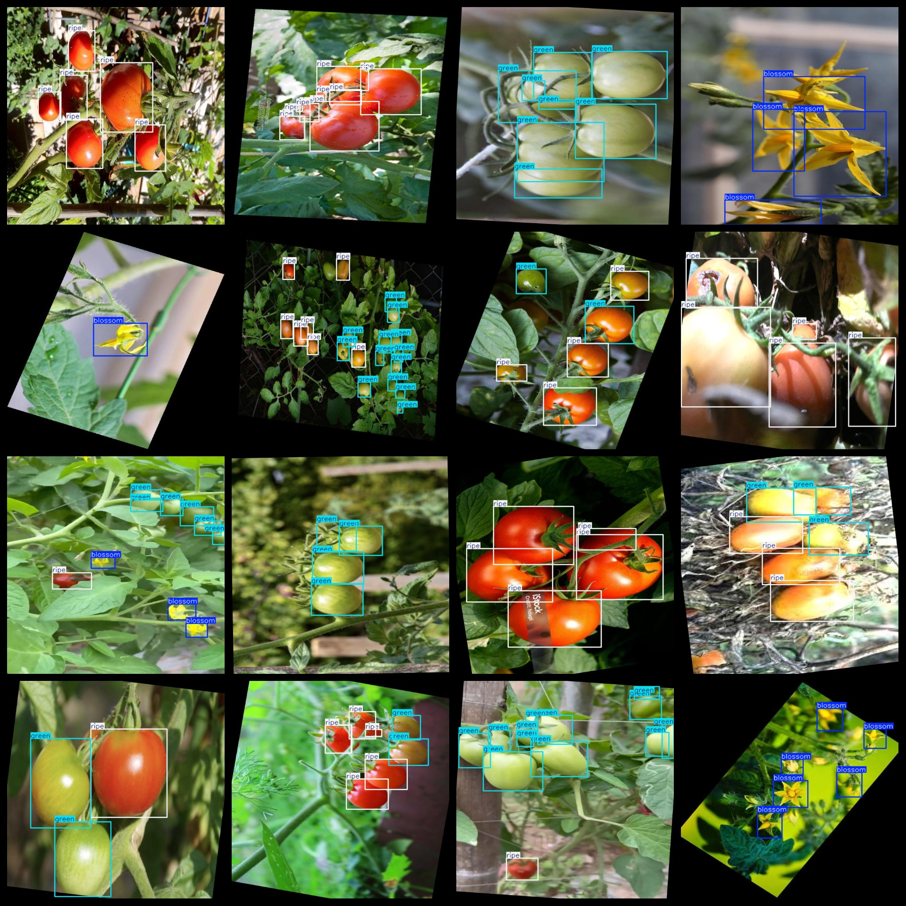
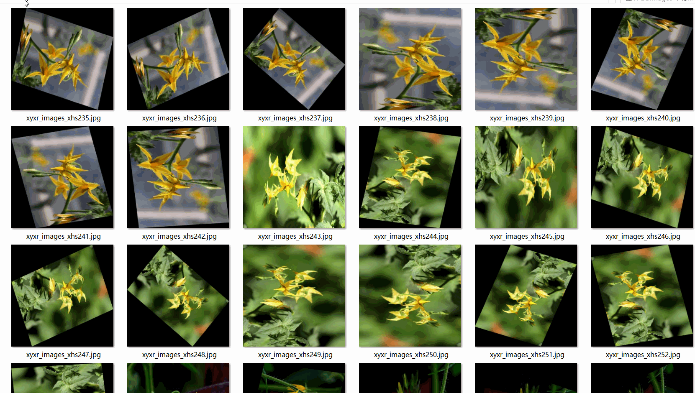

# Tomato Open Flower Fruit Ripeness Situation Detection Dataset 8036 imagesVOC+YOLO format

Tomato flower opening, fruit ripeness situation detection dataset contains 8036 images in the VOC+YOLO format.

The dataset is organized into three folders: JPEGImages for storing images, xml for storing annotations, and txt for storing labels.

In the JPEGImages folder, there are a total of 8036 JPEG images.

The Annotations folder contains a total of 8036 xml files for annotation.

The labels folder contains a total of 8036 txt files for labels.

There are a total of 3 types of labels: "blossom", "green", and "ripe".

The number of boxes (in yolo format) for each label are as follows:

- blooms: 8913 boxes
- green: 22597 boxes
- ripe: 23642 boxes

Total box count: 55152

The image resolution is clear.

The images have been enhanced.

The repository location is datasets_sl.

The shape of the labels is a rectangular box, used for target detection recognition.

Important note: No 001 yet.

Special statement: The dataset does not guarantee the accuracy or weights of the trained models. The dataset only provides accurate and reasonable annotations.

The annotation and image details are as follows:

## Images

---

Here is a pay link on Stripe (https://buy.stripe.com/3cs8yP7sY87d0vu9AB). Please contact me lonlonago@foxmail.com after funding $89, and I will send you a complete data files, thank you!

